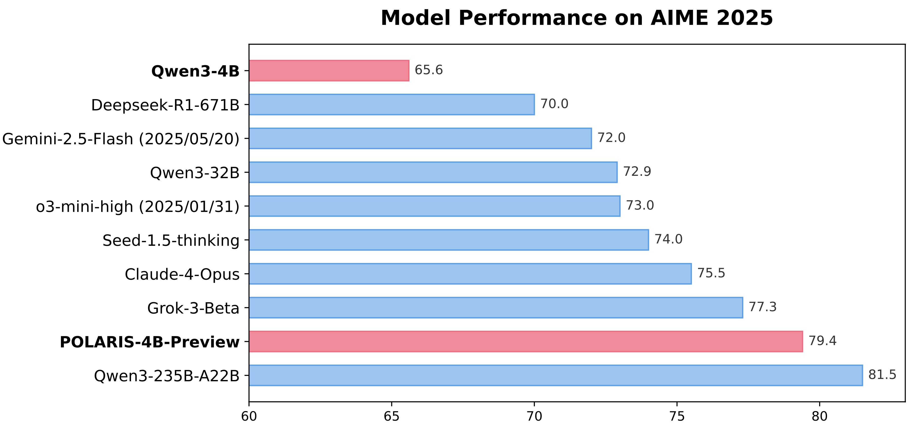

<div align="center">

#  POLARIS

<div>
   🌠 A <strong>PO</strong>st-training recipe for scaling R<strong>L</strong> on <strong>A</strong>dvanced <strong>R</strong>eason<strong>I</strong>ng model<strong>S</strong> 🚀
</div>
</div>
<div>
<br>

<div align="center">

[](https://honorable-payment-890.notion.site/POLARIS-A-POst-training-recipe-for-scaling-reinforcement-Learning-on-Advanced-ReasonIng-modelS-1dfa954ff7c38094923ec7772bf447a1)
[](https://x.com/AnChancy46881/status/1936099024769368506)
[](https://huggingface.co/POLARIS-Project/Polaris-4B-Preview)
[](https://huggingface.co/datasets/POLARIS-Project/Polaris-Dataset-53K)
[]()
</div>
</div>


## Overview

Polaris is an open-source post-training recipe that leverages reinforcement learning (RL) scaling to further optimize models with strong reasoning capabilities. Our work demonstrates that even state-of-the-art models like Qwen3-4B can achieve remarkable gains on complex reasoning tasks when enhanced with Polaris.
By training with open-source data and academic-grade resources, Polaris elevates the performance of open-recipe reasoning models to an entirely new level. In benchmark evaluations, our approach astonishingly outperforms leading commercial systems such as Claude-4-Opus, Grok-3-Beta, and o3-mini-high(2025/01/03).

This work is done as part of the [HKU NLP Group](https://hkunlp.github.io/) and [Bytedance Seed](https://seed.bytedance.com/). Our training and evaluation codebase is built on [Verl](https://github.com/volcengine/verl). To foster progress in scaling RL on advanced reasoning models, we are open‐sourcing our complete dataset, code, and training details for the research community.


<div align="center">

</div>


## 🔥Releases
<strong>[2025/06/27]</strong>
- 🌌 Full training code and scripts are available. 
- 🤗 We are training a smaller model `Qwen3-1.7B` with the open-source codebase. The training logs will be updated to enhance reproducibility.
- ⌨️ Polaris-Coder is coming soon. Stay tuned!

<strong>[2025/06/20]</strong>
- 🧾 The Blog that details our training recipe: [Notion](https://honorable-payment-890.notion.site/POLARIS-A-POst-training-recipe-for-scaling-reinforcement-Learning-on-Advanced-ReasonIng-modelS-1dfa954ff7c38094923ec7772bf447a1) and [Blog](https://hkunlp.github.io/blog/2025/Polaris)
- 🤗 Model weights: [Polaris-4B-Preview](https://huggingface.co/POLARIS-HKU/Polaris-4B-Preview) and  [Polaris-7B-Preview](https://huggingface.co/POLARIS-Project/Polaris-7B-Preview). Polaris-4B-Preview is fine-tuned from Qwen3-4B and Polaris-7B-Preview is fine-tuned from Deepseek-R1-Distill-Qwen-7B.
- 📚 The filtered training dataset with difficulty distribution  [Polaris-Dataset-53K](https://huggingface.co/datasets/POLARIS-Project/Polaris-Dataset-53K)

## Running environment 
```bash
cd Polaris
pip install -e ./verl 
pip install -e ./
pip install transformers==4.51.0
pip install vllm==0.8.4
pip install tensordict==0.6.2

# do not use xformers backend
unset VLLM_ATTENTION_BACKEND

```
## Demo
```python
import torch
from transformers import AutoTokenizer
from vllm import SamplingParams, LLM


example = {
        "question": "Find the largest possible real part of \\[(75+117i)z+\\frac{96+144i}{z}\\]where $z$ is a complex number with $|z|=4$.\nLet's think step by step and output the final answer within \\boxed{}.",
        "answer": "540"
}


model = "/path/to/Polaris-4B-Preview"

tokenzier = AutoTokenizer.from_pretrained(model)

llm = LLM(
    model=model,
    dtype=torch.bfloat16,
    tensor_parallel_size=1,
    gpu_memory_utilization=0.9
)

sampling_params = SamplingParams(
    temperature=1.4,
    top_p=1.0,
    max_tokens=90000
)

question = example["question"]
answer = example["answer"]
output = llm.generate(
            prompts=tokenzier.apply_chat_template(conversation=[{"content": question, "role": "user"}],
                                                  add_generation_prompt=True,
                                                  tokenize=False),
            sampling_params=sampling_params
        )
print(f"***QUESTION***:\n{question}\n***GROUND TRUTH***:\n{answer}\n***MODEL OUTPUT***:\n{output[0].outputs[0].text}\n")
```


## 📊Evaluation
We recommend using a higher temperature for decoding than that suggested for Qwen3 (0.6 → 1.4). However, it is not advisable to exceed the temperature used during training. For POLARIS, a longer response length (> 64K) should be utilized to prevent performance degradation from truncation, which could otherwise cause its performance to fall below that of Qwen3. All other settings remain the same. 
```bash
./scripts/eval/eval_model_aime24.sh --model /path/to/model --n 32 --max_length 90000 --k 20 --t 1.4 
./scripts/eval/eval_model_aime25.sh --model /path/to/model --n 32 --max_length 90000 --k 20 --t 1.4 or 1.45
```
**Grade the outputs**:
```bash
python evaluation/grade.py --file_name evaluation/results/aime24-reproduced.parquet # replace with your output file
```

## Training
### Data preparation
The [training data](https://huggingface.co/datasets/POLARIS-Project/Polaris-Dataset-53K) used in this work is filtered from [DeepScaleR-dataset-40K](https://huggingface.co/datasets/agentica-org/DeepScaleR-Preview-Dataset) and [AReaL-dataset-106K](https://huggingface.co/datasets/inclusionAI/AReaL-boba-Data).
We provide the [parquet data](https://github.com/ChenxinAn-fdu/POLARIS/tree/main/parquet) which can be directly used in training. 
If your data is in `json` or `jsonl` format, please use the following cmd for converting it into the parquet format. 
```bash
# Generate parquet files for parquet_data/polaris-data-53K.parquet 
python scripts/data/jsonl2parquet.py --jsonl_file data/jsonl_data/polaris-data-53K.jsonl 
```

<!-- ### Optional: Temperature searching for diversity rollouts
Temperature searching is highly recommended before each stage of training as suggested by the `diversity-based rollouts sampling` section in our blog. 

You can *skip* the searching process and follow our settings for training `Qwen3-4B`, `Qwen3-1.7B`, and `Deepseek-R1-Distill-Qwen-7B`

Run the following code for searching on your new model:
```bash
# the following code will provide the optimal training temperature for the model
cd evaluation
python search_optimal_temperature.py --start 0.6 --end 1.5 --step 0.05 --model /path/to/model --n 16 --new_tokens 50000 --output_dir /path/to/output_dir
python get_optimal_temperature.py  --output_dir /path/to/output_dir
``` -->

### Multi-stage training on single node
The training scripts for `Qwen3-1.7B`, `Qwen3-4B`, `Deepseek-R1-Distill-Qwen-7B` are avaliable [here](https://github.com/ChenxinAn-fdu/POLARIS/tree/main/scripts/train). You can run the scripts on a single node by:
```bash
 ###### stage1 ######
./scripts/train/qwen3-4b/stage1.sh  --model /path/to/qwen3-4b --data_path parquet/stage1/qwen3-4b-s1.parquet --experiment_name qwen3-4b-stage1 (unique experiment id)

 ###### stage2 ######
# convert the checkpoint after stage1-training to hf model
python verl/scripts/model_merger.py --local_dir /path/to/checkpoints/global_step_xxx/actor --target_dir checkpoints_hf/ckpt-4b-stage1

# You can follow our temperature setting but re-searching for the optimal temperature for  `checkpoints_hf/ckpt-4b-stage1` is a better approach.
python search_optimal_temperature.py --start 0.6 --end 1.5 --step 0.05 --model /path/to/model --n 16 --new_tokens 50000 --output_dir /path/to/output_dir
python get_optimal_temperature.py  --output_dir /path/to/output_dir

# You can use our provided data but drop the easy data based on your training process is a better approach.
python drop_easy_data.py --data_path parquet/stage1/qwen3-4b-s1.parquet --experiment_name qwen3-4b-stage1  --output parquet/stage2/qwen3-4b-s2.parquet.parquet

# stage2 training 
./scripts/train/qwen3-4b/stage2.sh  --model checkpoints_hf/polarie-4b-stage1 --data_path parquet/stage2/qwen3-4b-s2.parquet --experiment_name qwen3-4b-stage2 

 ###### stage3 ######
# convert the checkpoint after stage1-training to hf model \ search for the optimal temeprature \ remove the easy samples
# stage3 training 
./scripts/train/qwen3-4b/stage2.sh  --model heckpoints_hf/polarie-4b-stage2  --data_path parquet/stage3/qwen3-4b-s3.parquet --experiment_name qwen3-4b-stage3
```

### Debug
`Pdb` is not supported in Ray. In this codebase you can set `trainer.debug=True` and insert `breakpoint()` (instead of `pdb.set_trace()`) to debug.
```python
...
batch = batch.repeat(repeat_times=self.config.actor_rollout_ref.rollout.n, interleave=True)
breakpoint()
batch = batch.union(gen_batch_output)
...
```
```
# open a new terminal and run:
ray debug
```

### Multi-node training 
To accelerate the training process, we recommend using at least 4 nodes.
Our multi-node training is based on Ray.
You can run `ray start --head` on the head node and `ray start --address=[RAY_ADDRESS]` on other nodes to start the Ray cluster. and run the training script on the head node. We also prepare a useful script which is **very easy** to start the training:

```bash
# On all nodes, run:
python train_with_ray.py  --model /path/to/model --experiment_name [name] --n_nodes 4   --sh /path/to/training/script.sh --data_path /path/to/parquet/data --head (if head node)
```


### Results 

| **Models** | **AIME24 avg@32** | **AIME25 avg@32** | **Minerva Math avg@4** | **Olympiad Bench avg@4** | **AMC23  avg@8** |
| --- | --- | --- | --- | --- | --- |
| `Deepseek-R1-Distill-Qwen-7B` | 55.0 | 39.7 | 36.7 | 56.8 | 81.9 |
| `AReal-boba-RL-7B` | 61.9 | 48.3 | 39.5 | 61.9 | 86.4 |
| `Skywork-OR1-7B-Math` | 69.8 | 52.3 | **40.8** | 63.2 | 85.3 |
| **`POLARIS-7B-Preview`** | **72.6** | **52.6** | 40.2 | **65.4** | **89.0** |
| `Deepseek-R1-Distill-Qwen-32B` | 72.6 | 54.9 | 42.1 | 59.4 | 84.3 |
| `qwen3-32B` | 81.4 | 72.9 | 44.2 | 66.7 | 92.4 |
| `qwen3-4B` | 73.8 | 65.6 | 43.6 | 62.2 | 87.2 |
| **`POLARIS-4B-Preview`** | **81.2** | **79.4** | **44.0** | **69.1** | **94.8** |
| **`POLARIS-1.7B-Preview`** |  |  |  |  |  |


## Acknowledgements
The training and evaluation codebase is heavily built on [Verl](https://github.com/volcengine/verl). The reward function in polaris in from [DeepScaleR](https://github.com/agentica-project/rllm). Our model is trained on top of [`Qwen3-4B`](https://huggingface.co/Qwen/Qwen3-4B) and [`DeepSeek-R1-Distill-Qwen-7B`](https://huggingface.co/deepseek-ai/DeepSeek-R1-Distill-Qwen-7B). Thanks for their wonderful work.


## Citation
```bibtex
@misc{Polaris2025,
    title = {POLARIS: A Post-Training Recipe for Scaling Reinforcement Learning on Advanced Reasoning Models},
    url = {https://hkunlp.github.io/blog/2025/Polaris},
    author = {An, Chenxin and Xie, Zhihui and Li, Xiaonan and Li, Lei and Zhang, Jun and Gong, Shansan and Zhong, Ming and Xu, Jingjing and Qiu, Xipeng and Wang, Mingxuan and Kong, Lingpeng}
    year = {2025}
}
```

